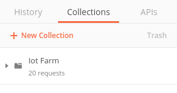

# Iot Farm API Postman Resources 

These files provide API resources that you can import in to Postman to execute.

* The [Iot Farm.postman_collection.json](Iot%20Farm.postman_collection.json)
provides the individual API resources. They are standalone requests that you can execute or use to build up an end to end workflow.
* The [Iot Farm.postman_environment.json](Iot%20Farm.postman_environment.json)
provides default enviroment variables that can be altered so that each of the API collections works against your own environment.

## Requirements

[Postman Client](https://www.getpostman.com)

## Installation

The included ***.json*** files were built using the Postman client. It is recommended that you install the latest client from [Postman](https://www.getpostman.com.

Once installed, start Postman, and select the **Import** button in the upper left corner:

You will see the import dialog open:

You can drag and drop the JSON files in this directory one at a time on to the
dialog area where is says Drop files here or you can select the **Choose files**
button to open a file chooser dialog and navigate to the location on your system
where this directory resides, and select the JSON file.

The JSON files include both the API collections and also a default ***Environment*** that can be altered so that each of the API collections works against your own environment.

Now, navigate to the file [Iot Farm.postman_collection.json](Iot%20Farm.postman_collection.json) location and import it.

To import the enviroment file ([Iot Farm.postman_environment.json](Iot%20Farm.postman_environment.json)), click to **Gear** button at the upper right corner 

Then click **Import** button at the bottom in ***MANAGE ENVIROMENTS*** dialog:

Finally, click **Choose Files** button then locate the file [Iot Farm.postman_environment.json](Iot%20Farm.postman_environment.json)

## How to use

Once imported, you will see something similar to:

Firstly, you will need to adjust the imported environment to work with the Iot Farm project, to do this click the eye icon near the top right.

Secondly, click the **edit** link to edit the ***Iot Farm*** environment.  Replace the values for each item to reflect the test Iot Farm project you will be working with.  As a minimum for most samples to work you will need to alter details for Iot Farm project, login and password providing credentials here.

From here, you can expand either the resources to see the individual API surfaces
or expand the samples and see some of the ways you can string together the
individual resources to make a use case.

Iot Farm Authentication samples:

